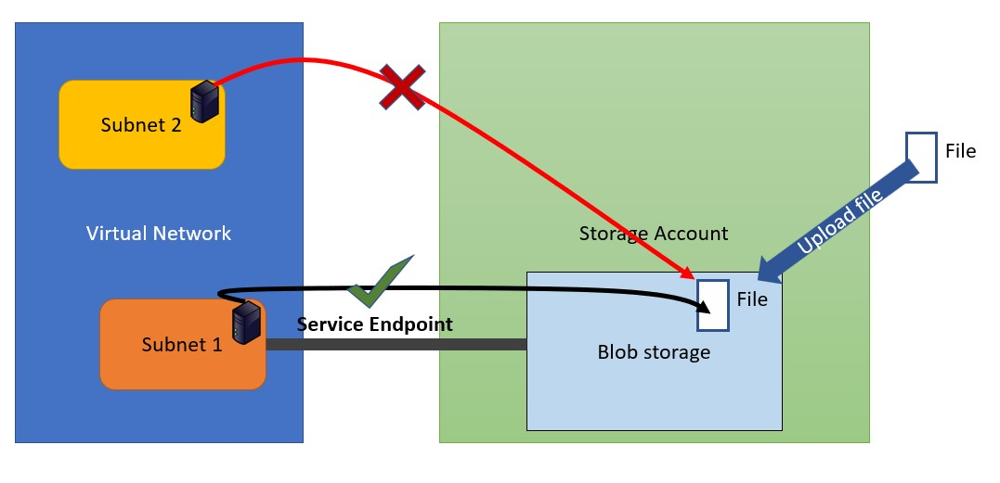

<!--
    <details><summary>Click for hint</summary><Strong> 

    ``` 
    HINT
    ```
    </Strong></details> 
    <details><summary>Click to see the answer</summary><Strong> 
    
    ```
    ANSWER
    ```
    </Strong></details> 
-->
# Azure Access to Storage account via a Service Endpoint



# Use following outline to complete this project

- Create a Virtual Network
  - Choose the VNet address range yourself
  - Make sure there is two subnets in the Vnet
  - Subnet 1
    - From the first subnet create a service endpoint to Storage Account services
    - Create a Windows VM within the first subnet (you can choose which settings to apply)
  - Subnet 2
    - From the second subnet DO NOT create a service endpoint to Storage Account services
    - Create a Windows VM within the second subnet (you can choose which settings to apply)
- Create a Storare Account (configure it as follows)
  - Make sure the Storage Accounts network settings only allows access from Subnet 1
  - Create a Blob storage (Container) 
  - Add a file to the blob storage
  - Create a SAS token to gain access to the blob store
    - Make sure the SAS token only allows access from the first subnet
- On the VM in subnet 1 attempt to use the SAS token URL to access the file that was uploaded to the blob store
- On the VM in subnet 1 attempt to use the SAS token URL to access the file that was uploaded to the blob store

## What must the lab achieve

- One Vnet
- Two Subnets
- First subnet to have a service enpoint configured
- Storage Account configured with a blob storage and configured to restrict access

## Test if your Azure security

- After creating the structure above
  - Make sure you can access the blob store from subnet 1
  - Make sure you cannot access the blob store from subnet 2

## Clean up 
- Remove all the Resource Groups that you have created 
   
