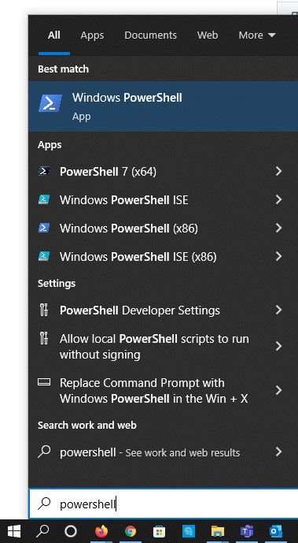

# Clone a GitHub Repo

## Cloning 

### 1 Open PowerShell
- Click the Start menu and type PowerShell
- Click "Windows Powershell"

### 2. Create Git Home folder in your Documents folder
- From the PowerShell windows type: cd ~\Documents
- Hit the ENTER key
- Now type: mkdir .\githome
- Hit the ENTER key

---

### 3. Go to your githome folder
- From the PowerShell windows type: cd .\githome
- Hit the ENTER key
- Leave the PowerShell window open as we will come back to it soon

---

### 4. Go to your Git Hub site
- Open a web browser (Chrome preferred) and go to your GitHub site you recoded earlier *(do not use Internet Explorer)* 

### 5. Repositories
- On the GitHub site 
- Click the "Repositories" menu 

### 6. Locate your Repo
- Click on the name of your repository

### 7. Find and Copy the Clone URL
- Click on the Green "Code" button
- Copy the URL listed by clicking the two boxes to the right of the URL

- Click on "Code" (The Green Button)
- Under the clone section you will see a URL "https://githuib.com/....."
- This is the URL we will use later, for cloning the Repo to our local PC

### 4. Go to your githome folder
- From the PowerShell windows type: 
- Hit the ENTER key

---
