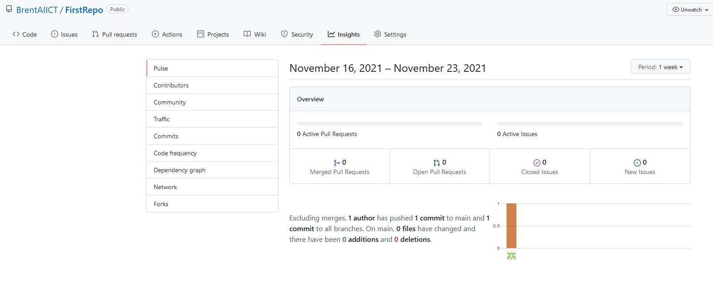

# Lets Explore the Repository

## Lets look around your new Repo (common name for repository)

### 1. Inspect the Branches
- Click on "main"
- ensure it shows only the main branch

---

### 2. Clone information under "Code"
- Click on "Code" (The Green Button)
- Under the clone section you will see a URL "https://githuib.com/....."
- This is the URL we will use later, for cloning the Repo to our local PC

### 3. 
- Click on "<>Code" 
- This shows you the files that are stored in this repo

### 4. 
- Click on "Issues"
- This section is where we can record problems or suggestions for feature improvements
- You could add an issue by clicking the green button "New Issue" 

### 5. 
- Click on "Pull Requests"
- Under this section you can issue a pull request
- This allows the changes made in this repository to be checked and merged into the main branch

### 6. 
- Click on "Insights"
- Under this section you will see inforamtion regarding what is happening to the repo 
- Here we can track pull requests and issues under Pulse
- We can see the merged branches under Network
- etc

---
---

