# Managing a Local Git Repo

## Making Changes

### 1 Open PowerShell
- Click the **Start** menu and type PowerShell
- Click **Windows Powershell**


---

### 2. Go to your Git Home folder in your Documents folder
- From the PowerShell window type: **cd ~\Documents**
- Hit the **ENTER** key
- Now type: **cd .\githome\NameOfYourRepo** \(*make sure you put your own repo name here*)
- Hit the **ENTER** key

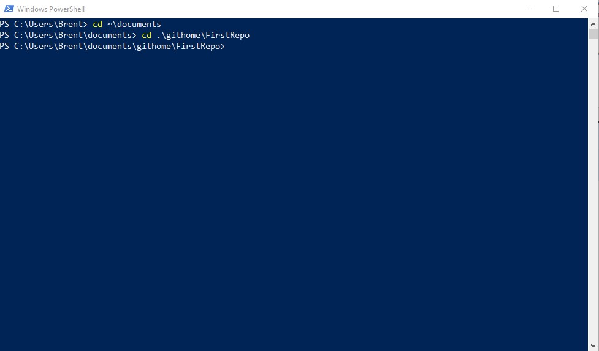
---

### 3. Check the Status of Git
- Always do a **git fetch** before running getting ready to make changes
- From the PowerShell window type: **git status**
- Hit the **ENTER** key
- This report tells us that the Git repo has no changes to sync

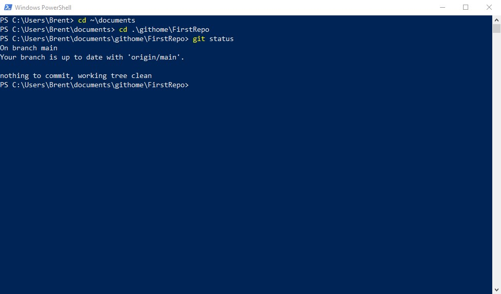
---

### 4. Create a new file
- From the PowerShell window type: **New-Item -Path . -Name FirstFile.txt -Value "The first line"**
- Hit the **ENTER** key
- This report tells us that the Git repo has no changes to sync

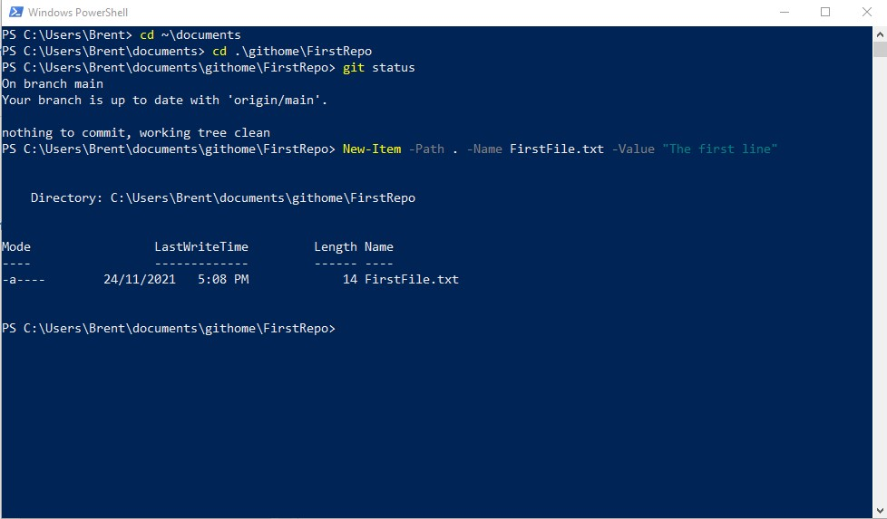
---

### 5. Check the Status of Git again
- From the PowerShell window type: **git status**
- Hit the **ENTER** key
- This report tells us that the Git repo has an untracked file
- *The name of the file is in red and difficult to read here*


---

### 6. Tell Git to track any new file changes
- From the PowerShell window type: **git add \.**
- Hit the **ENTER** key


---

### 7. Check the Status of Git again
- From the PowerShell window type: **git status**
- Hit the **ENTER** key
- This report tells us that the Git repo has files that need to be committed

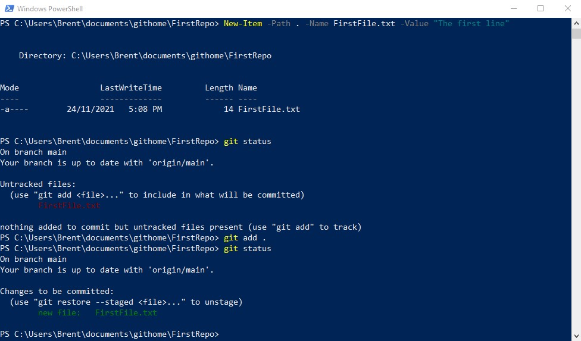
---

### 8. Tell Git to commit any new file changes
- From the PowerShell window type: **git commit -m "New file added to repo"**
- Hit the **ENTER** key

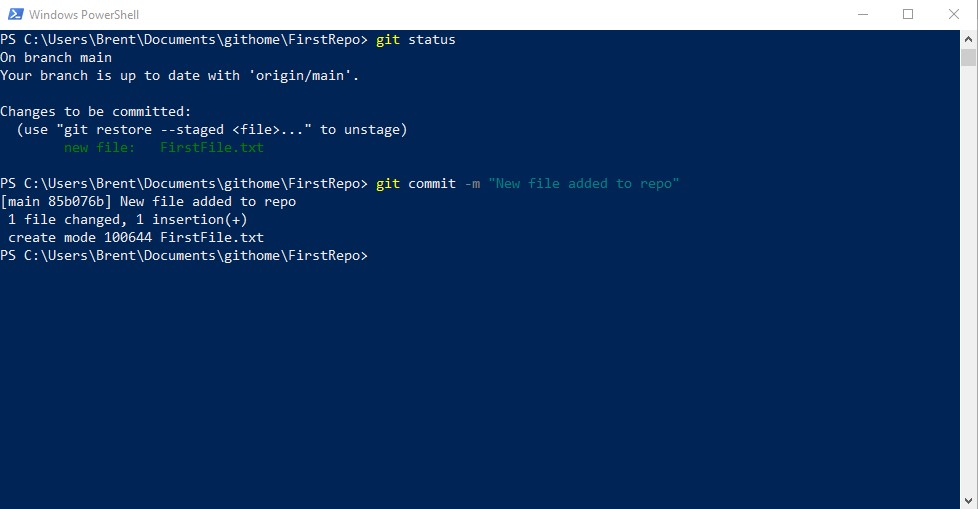
---

### 9. Check the Status of Git again
- From the PowerShell window type: **git status**
- Hit the **ENTER** key
- This report tells us two things
  - Our local Git repo is up to date with the changes
  - The GitHub copy of our repo is now out of date, meaning we need to push the changes back to GitHub

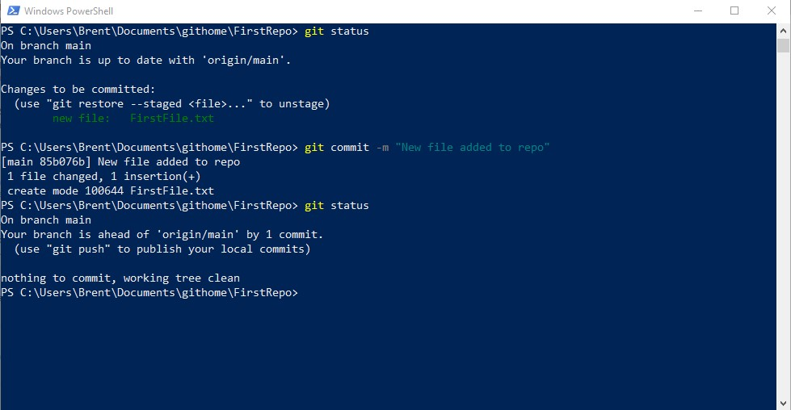
---

### 10. Tell Git to Push all the changes up to GitHub
- From the PowerShell window type: **git push --all**
- Hit the **ENTER** key

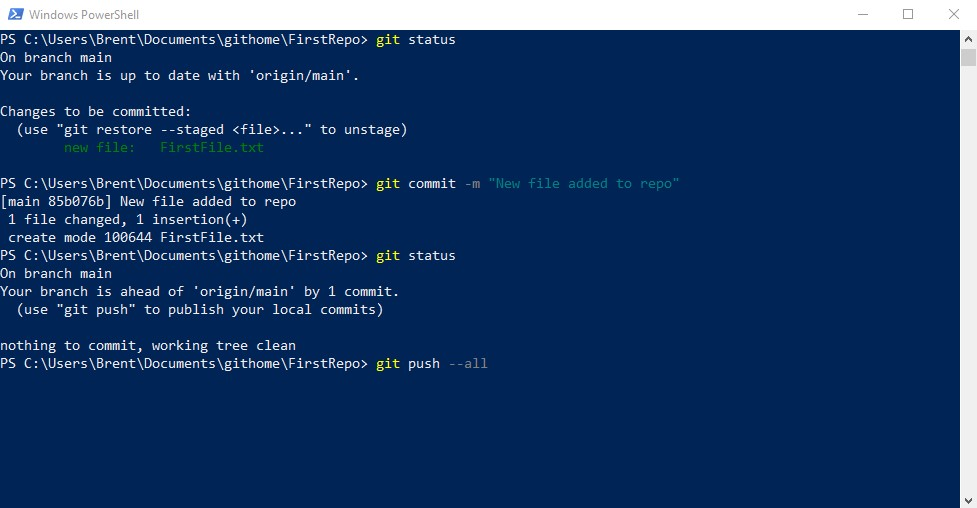
---

### 11. Git Need Permission to push to GitHub
- GitHub requires Git to show it has permission to push
- This screen will appear asking Git to Sign in
- Click **Token**
- Leave this window open, you will need to enter a token here later

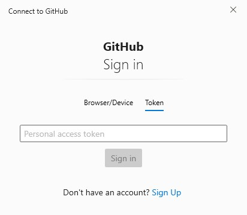
---

### 12. Open Settings in GitHub
- Go to your GitHub site
- Click the **icon** in the top right that links to your account
- Click **Settings**


---

### 13. 
- Once the settings window appears
- click **Developer Settings**


---

### 14. Personal Token
- Click **Personal access token**
- Click **Generate new token**


---

### 15. Token Details
- Give you token a **name**
- You can change the **Expiration** if you wish
- Tick **all of the scopes** to give you full access

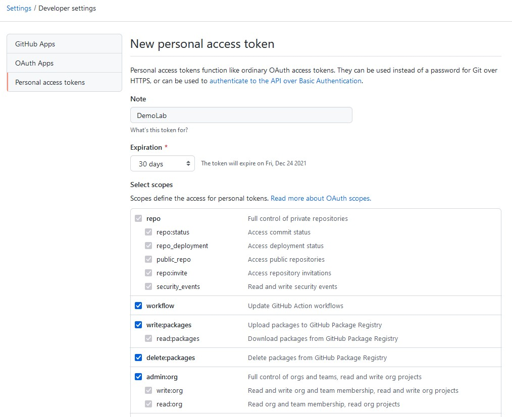
---

### 16. Generate Token
- Scroll to the bottom of the scopes
- Click **Generate Token** button


---

### 17. Copy The Token
- Click the **two boxes icon**, to the right of the token, to copy the token
- You will need to record this token and store it in a safe place
  - you will never be able to display this again from GitHub

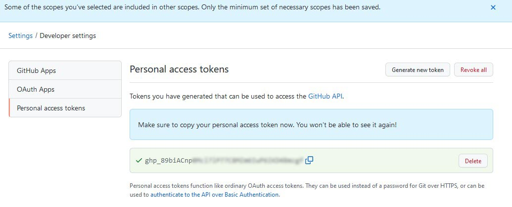
---

### 18. Complete Sign in
- Go back to the Sign in window *from step 11*
- Paste in the token 
- Click **Sign In** button

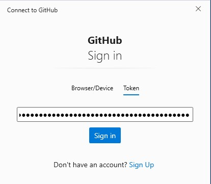
---

### 19. Push Process Completes
- Go bask to the PowerShell window
- Wait until the push process completes


---

### 20. Check the status again
- In the PowerShell window type: **git status**
- This now shows that the local repo is now in sync with the GitHub Repo


---

### 21. Check GitHub
- Go to the GitHub web site 
- You may have to refresh the web browser
- If the push was successful you will now see two files
  - README.md 
  - FirstFile.txt

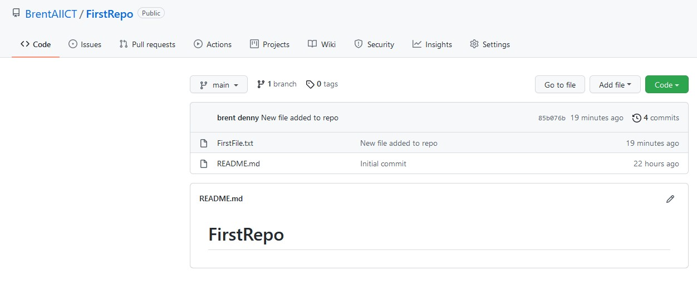
---

### From Here On
- Because all of the setup and permissions are now in place
- Whenever you make changes to the Repo
- You ONLY need to do the following to add, commit and push the new changes
- Here is the Git workflow:

``` 
git pull --all

Make your changes that are needed

git add .
git commit -m "A description of the change"
git push --all
```
- Firstly the **git pull** command downloads changes in the GitHub Repo that you do not currently have in your local Git Repo
- Then you make changes to the files in the repo directory
- The **git add** command allows git to track the changes by adding the changes to a staging area
- The **git commit** command takes the changes in the staging area and make a permanent snapshot of the repo
- These committed changes are then be pushed up to GitHub with the **git push** command
--- 

## What is the benefit of Git and GitHub
- Git and GitHub 
  - Allows us to **reverse commits** and return to previous versions of the file
  - Allows **multiple people to work on a project** at the same time
  - Allows us to **create branches** from the main branch
    - Changes to an alternative branch do not affect the main branch
    - Once approved the alternate branch code can be merged back into the main branch
    - This is an advanced topic, Your trainer can show you more about this if you wish
  - Allows us to write code and keep it in an **online repo**
    - This can be useful 
      - When you are heading for **job interviews**
      - **Collaborating** with others on GitHub       

---
<br>
<br>

[Some Git Commands](GitCommands.md#git-commands)

<br>
<br>

[Use the VSCode editor for git/GitHub](6-InstallVsCode.md#install-vscode-editor)
