# Install VSCode Editor

## Download VSCode Installer 

### 1. Download VSCode
- Open a web browser and go to  [https://code.visualstudio.com/Download](https://code.visualstudio.com/Download) *(do not use Internet Explorer)* 
- Click on the **64 Bit** blue rectangle, next to User Installer, under the Windows box

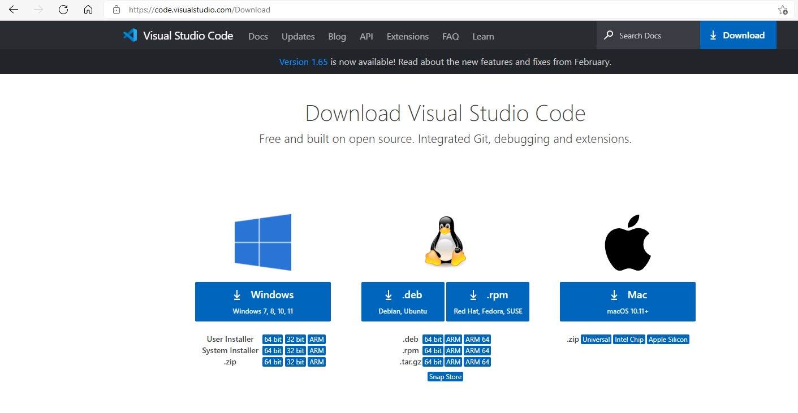
---

### 2. Wait for the download to start and complete
- The download web page will appear and in a few seconds, on the top right of the screen you will see the download progress

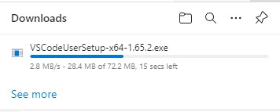
---

### 3. Find the downloaded file
- click the three dots **...** on the top right of the web browser
- Click **Downloads**

---

### 4. Run the VSCode installer
- Click **Open File**

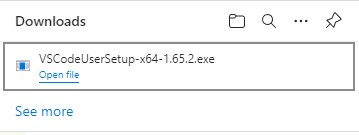
---

### 5. Setup Warning ⚠ 
- If you see a warning appear
- Click **OK**

---

### 6. Agree to the License Agreement 
- Click **I accept the agreement** radio button
- Click **Next >**

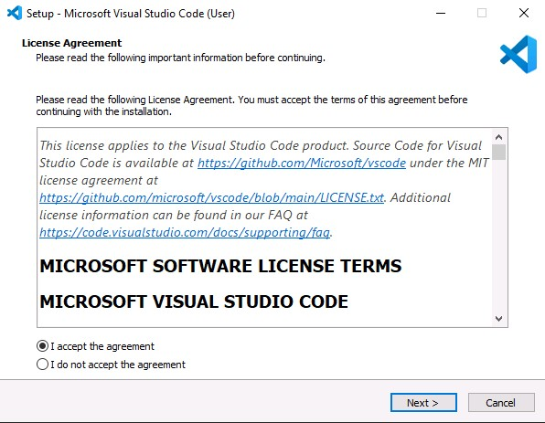
---

### 7. Select Destination Location
- Do not edit the default location 
- Click **Next >**

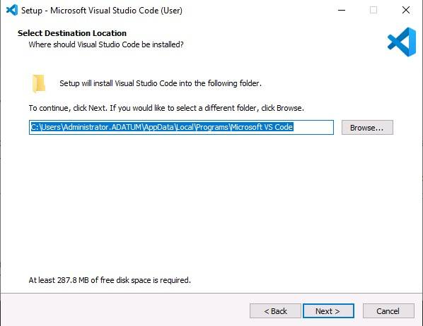
---

### 8. Select Start Menu Folder
- Click **Next >** to accept the default folder name

---

### 9. Select Additional Tasks 
- Click **Next >** to accept the default settings

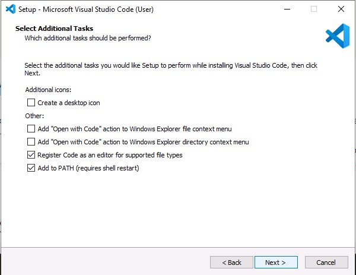
---

### 9. Ready to Install
- Click **Next >** to Install VSCode

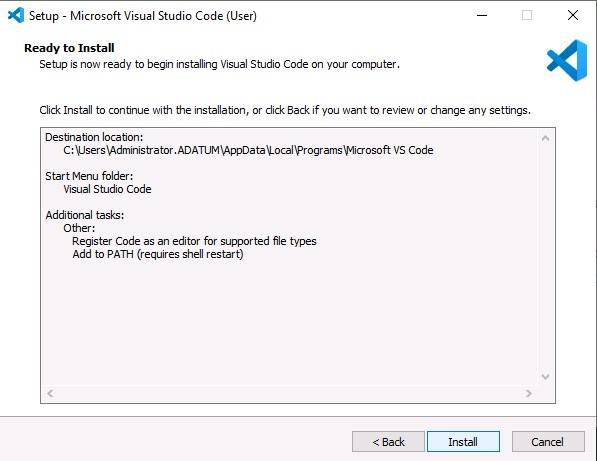
---

### 9. Installing
- Wait for the installation to complete

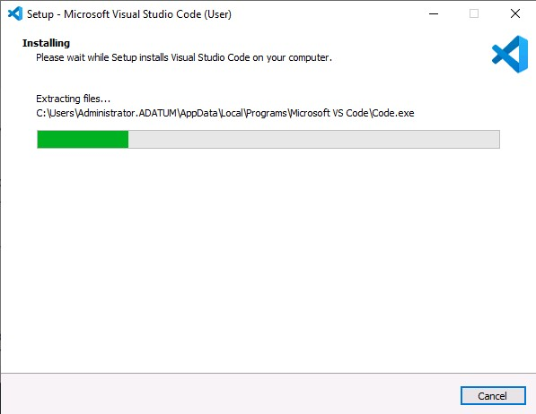
---

### 9. Installation Complete
- Untick the **Launch Visual Studio Code** check box
- Click **Finish**

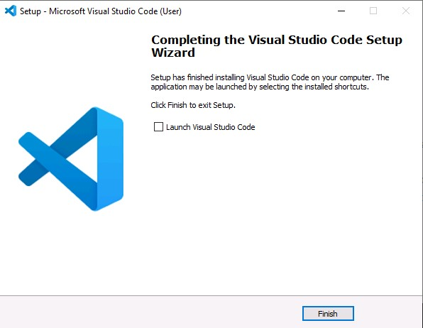
---

### 9. Close the web browser
- Click the **X** on the top right of the web browser to clode it

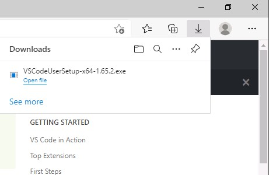
---

### 9. Start VSCode
- Type **VSCode** in the "Type here to search" box
- Click **Visual Studio Code**

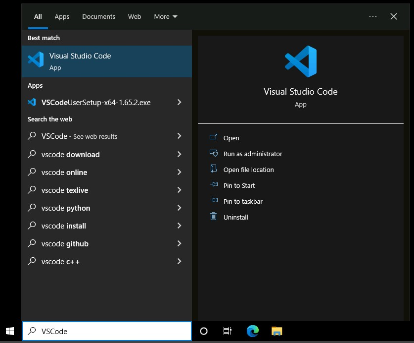
---

### 9. Enter Code
- Check your email inbox (*This is the email that you used to sign up for GitHub*)
- Find the email that was sent from Github and make note of the **code** that they sent you
- Back in the GitHub web site, enter the **code** in the following screen

---

### 9. Enter Code
- Check your email inbox (*This is the email that you used to sign up for GitHub*)
- Find the email that was sent from Github and make note of the **code** that they sent you
- Back in the GitHub web site, enter the **code** in the following screen

---

### 9. Enter Code
- Check your email inbox (*This is the email that you used to sign up for GitHub*)
- Find the email that was sent from Github and make note of the **code** that they sent you
- Back in the GitHub web site, enter the **code** in the following screen

---

### 9. Enter Code
- Check your email inbox (*This is the email that you used to sign up for GitHub*)
- Find the email that was sent from Github and make note of the **code** that they sent you
- Back in the GitHub web site, enter the **code** in the following screen

---

### 9. Enter Code
- Check your email inbox (*This is the email that you used to sign up for GitHub*)
- Find the email that was sent from Github and make note of the **code** that they sent you
- Back in the GitHub web site, enter the **code** in the following screen

---

### 9. Enter Code
- Check your email inbox (*This is the email that you used to sign up for GitHub*)
- Find the email that was sent from Github and make note of the **code** that they sent you
- Back in the GitHub web site, enter the **code** in the following screen

---

