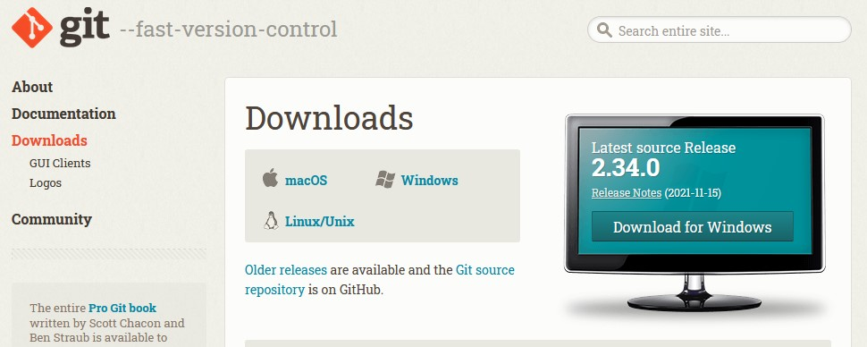
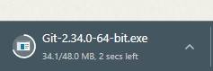
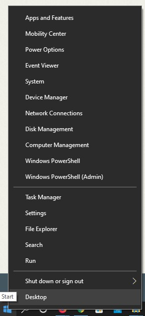
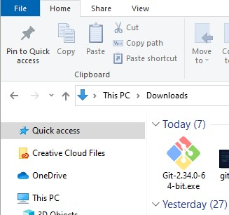
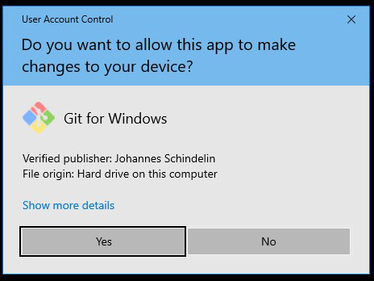
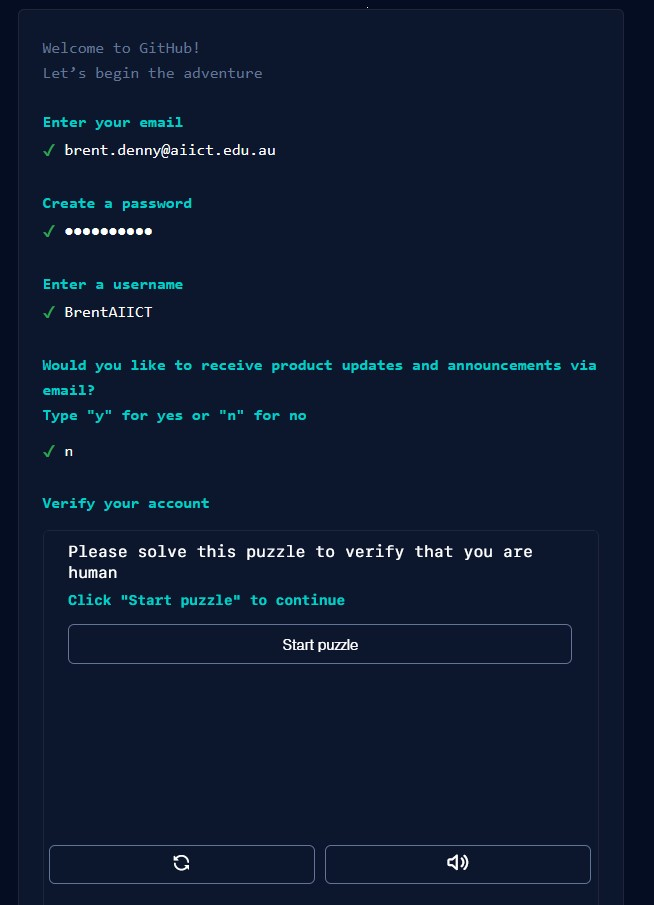
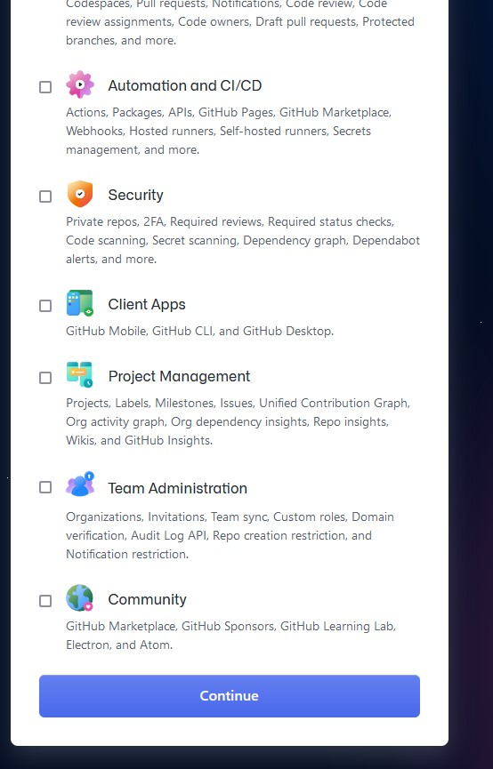
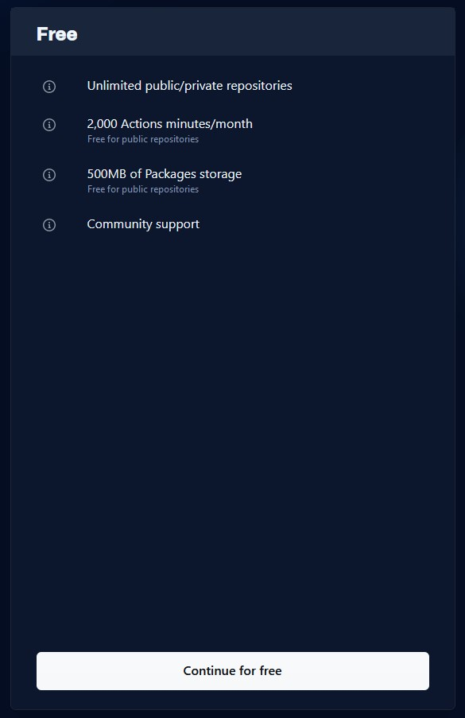

# Installing and Configuring Git on Your Local Computer 

## Download and Install Git

### 1. Download Git
- Open a web browser and enter the following (do not use Internet Explorer) 
```
https://git-scm.com/downloads
```
- Click on the "Download for Windows" link
- Click "Save File" if you are prompted to do so


---

### 2. Wait for the installer file to download
- On the bottom left of the chrome browser you will see the stratus of the download


---

### 3. Start File Explorer
- right click the start menu 
- click "File Explorer"


---


### 4. Run the Git installer file
- Within the File Explorer program go to the Downloads folder
- locate the Git-#.##.#-64bit.exe file (# represents a number)
- Right click on this file and choose "Open"


---


### 5. If needed, answer yes to the User Account Control
- Click on "Yes" if the User Account Control window appears


---

### 6. 
- 


---


### 7. 
- 


---

### 8. 
- 


---

### 9. 
- 


---

### 10. 
- 


---

### 11. 
- 


---

### 12. 
- 


