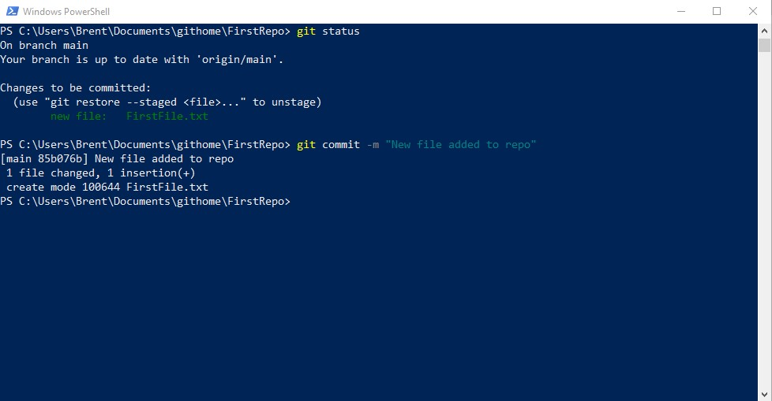
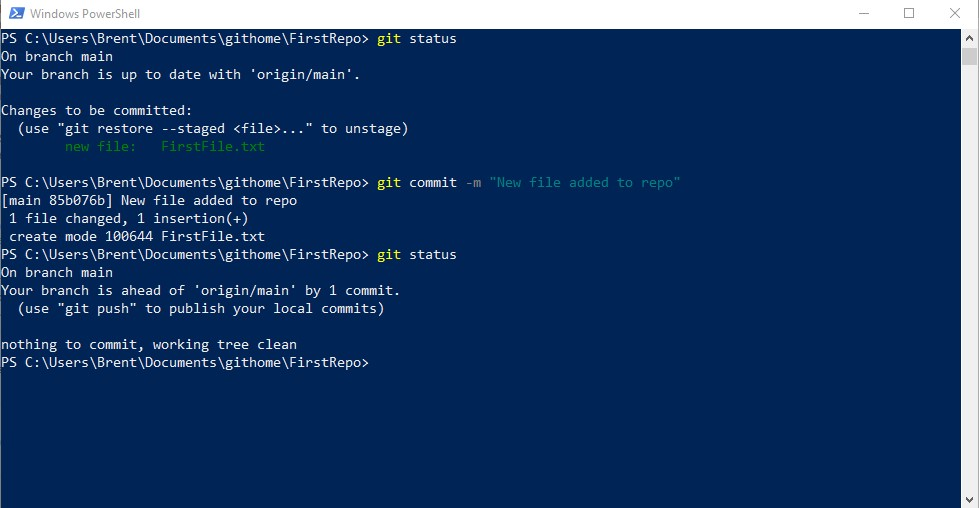

# Managing a Local Git Repo

## Making Changes

### 1 Open PowerShell
- Click the Start menu and type PowerShell
- Click "Windows Powershell"

### 2. Go to your Git Home folder in your Documents folder
- From the PowerShell window type: cd ~\Documents
- Hit the ENTER key
- Now type: cd .\githome\\*NameOfYourRepo* (*make sure you put your own repo name here*)
- Hit the ENTER key

---

### 3. Check the Status of Git
- From the PowerShell window type: git status
- Hit the ENTER key
- This report tells us that the Git repo has no changes to sync

---

### 4. Create a new file
- From the PowerShell window type: **New-Item -Path . -Name FirstFile.txt -Value "The first line"**
- Hit the ENTER key
- This report tells us that the Git repo has no changes to sync

---

### 5. Check the Status of Git again
- From the PowerShell window type: git status
- Hit the ENTER key
- This report tells us that the Git repo has an untracked file
- *The name of the file is in red and difficult to read here*

---

### 6. Tell Git to track any new file changes
- From the PowerShell window type: git add .
- Hit the ENTER key

---

### 7. Check the Status of Git again
- From the PowerShell window type: git status
- Hit the ENTER key
- This report tells us that the Git repo has files that need to be committed

---

### 8. Tell Git to commit any new file changes
- From the PowerShell window type: git commit -m "New file added to repo"
- Hit the ENTER key

---

### 9. Check the Status of Git again
- From the PowerShell window type: git status
- Hit the ENTER key
- This report tells us two things
  - Our local Git repo is up to date with the changes
  - The GitHub copy of our repo is now out of date, meaning we need to push the changes back to GitHub

---

### 10. Tell Git to Push all the changes up to GitHub
- From the PowerShell window type: git push --all
- Hit the ENTER key

---

### 11. Git Need Permission to push to GitHub
- GitHub requires Git to show it has permission to push
- This screen will appear asking Git to Sign in
- Click on "Token" 
- Leave this window open, you will need to enter a token here later

---

### 12. Open Settings in GitHub
- Go to your GitHub site
- Click on the icon in the top right that links to your account
- Click "Settings"

---

### 13. 
- Once the settings window appears
- click "Developer Settings"

---

### 14. Personal Token
- Click on "Personal access token"
- Click on "Generate new token"

---

### 15. Token Details
- Give you token a name
- You can change the Expiration if you wish
- Tick all of the scopes to give you full access

---

### 16. Generate Token
- Scroll to the bottom of the scopes
- Click "Generate Token" button

---

### 17. Copy The Token
- Use the two boxes icon to copy the token

---

### 18. Complete Sign in
- Got back to the Sign in window *from step 11*
- Paste in the token 
- Click "Sign In" button

---

### 19. Push Process Completes
- Go bask to the PowerShell window
- Wait until the push process completes

---

### 20. Check the status again
- In the PowerShell window type: git status
- This now shows that the local repo is now in sync with the GitHub Repo

---

### 21. Check GitHub
- Go to the GitHub web site 
- You may have to refresh the web browser
- If the push was successful you will now see two files
  - README.md 
  - FirstFile.txt

---
