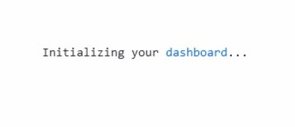
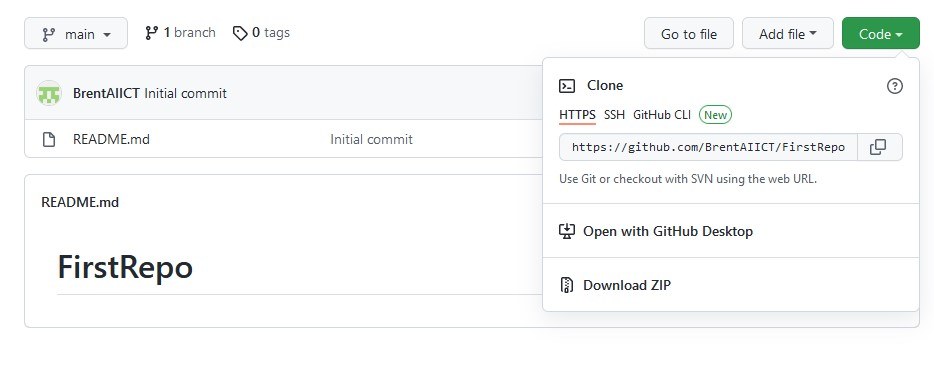
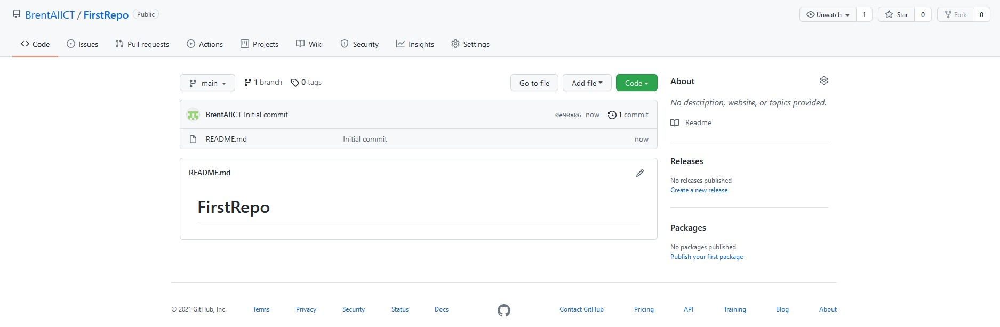

# Setup your own GitHub Site

## Create Github Site 

### 1. Sign up
- Open a web browser and enter the following (do not use Internet Explorer) 
```
https://www.github.com
```
- Click on the Sign Up link


---

### 2. Enter your email address
- Type your email address on this screen


---

### 3. Enter a password
- Type a password on this screen


---


### 4. Enter a Username
- Type a username on this screen (Something no one else has chosen)


---


### 5. Choose No 
- Type n to the question about receiving product updates


---

### 6. Verify Account
- Click "start puzzle" to verify you are not a robot


---


### 7. Complete Puzzle
- Choose the picture that satisfies the puzzle
- You may need to do this several times


---

### 8. Create Account
- Click "Create Account" to finish the sign up process


---

### 9. Enter Code
- Check your email
- Find the email from Github and make note of the code that they sent you
- Enter the code in this screen


---

### 10. Choose how you will use GitHub
- Choose "Just Me" from the top section 
- Choose "Student" from the bottom section


---

### 11. Select None of the Features 
- Just click Continue without selecting any features


---

### 12. Choose the Free option
- Click "Continue for free" option


---

### 13. Wait for the Dashboard
- A message will display Initializing your dashboard...
- Wait a few seconds and it the show the dashboard



### 14. Dashboard Appears
- This is the inital dashboard
- "Read the guide" is the documentation for GitHub, so read this later if you wish
- Do nothing on this screen yet


---

### 15. Create Your First Repository
- Click "Create repository"


---

### 16. Configure the Repository
- Type the name of your first repository (Make sure the name is available)
- Make sure it is set to public
- Click "Add a README file"


---

### 17. Configure the Repository
- Type the name of your first repository (Make sure the name is available)
- Make sure it is set to public
- Click "Add a README file"
- Click "Create Repository"


**Well done, your repository is created**
---
---
<br>
<br>

# Lets Explore the Repository

## Lets look around your new Repo (common name for repository)

### 1. Inspect the Branches
- Click on "main"
- ensure it shows only the main branch


---

### 2. Clone information under "Code"
- Click on "Code" (The Green Button)
- Under the clone section you will see a URL "https://githuib.com/....."
- This is the URL we will use later, for cloning the Repo to our local PC



### 3. 
- Click on "<>Code" 
- This shows you the files that are stored in this repo



### 4. 
- Click on "Issues"
- This section is where we can record problems or suggestions for feature improvements
- You could add an issue by clicking the green button "New Issue" 


### 5. 
- Click on "Pull Requests"
- Under this section you can issue a pull request
- This allows the changes made in this repository to be checked and merged into the main branch


### 6. 
- Click on "Insights"
- Under this section you will see inforamtion regarding what is happening to the repo 
- Here we can track pull requests and issues under Pulse
- We can see the merged branches under Network
- etc


---
