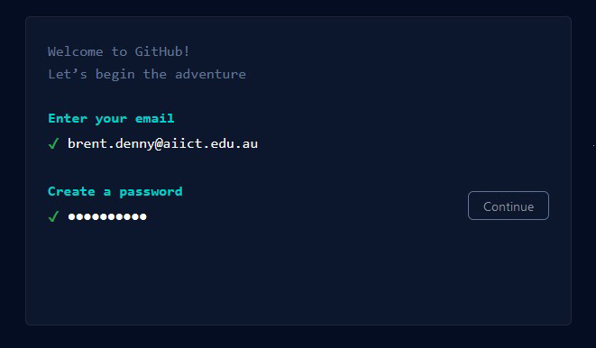
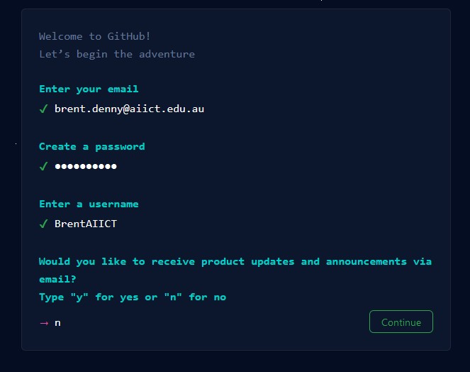
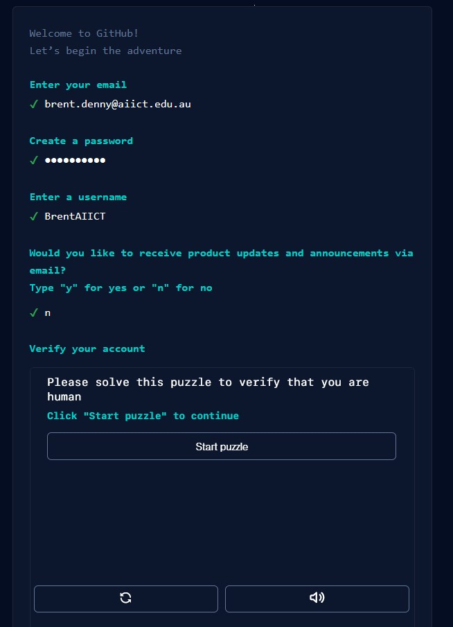
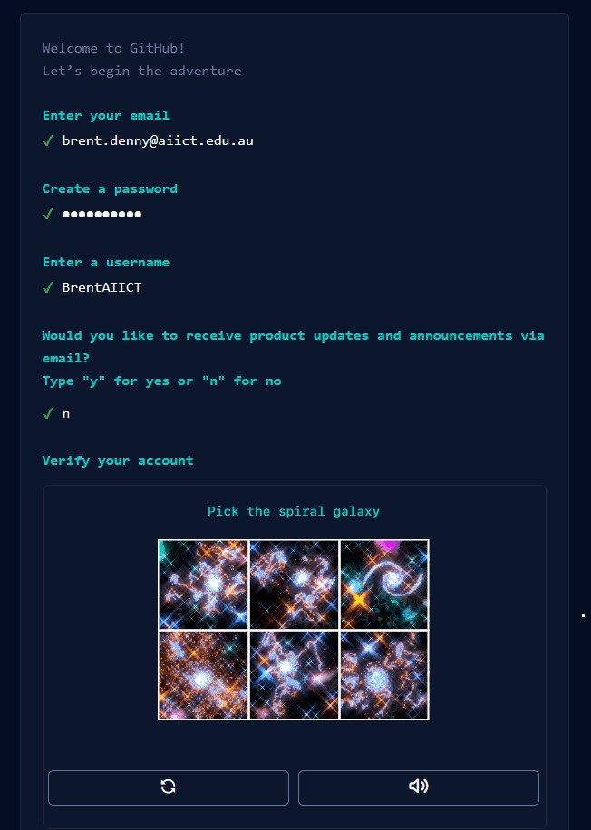
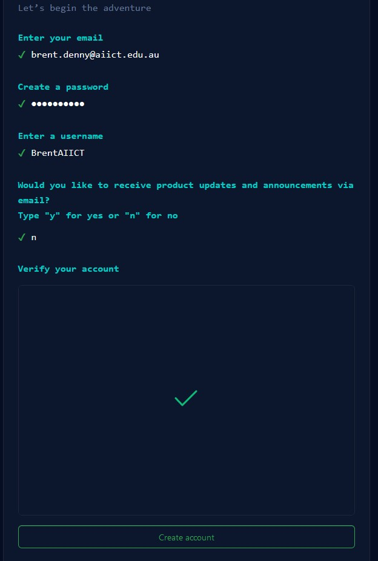

# Setup your own GitHub Site

## Create Github Site 

### 1. Sign up
- Open a web browser and enter the following (do not use Internet Explorer) 
```
https://www.github.com
```
- Click on the Sign Up link


---

### 2. Enter your email address
- Type your email address on this screen


---

### 3. Enter a password
- Type a password on this screen


---


### 4. Enter a Username
- Type a username on this screen (Something no one else has chosen)


---


### 5. Choose No 
- Type n to the question about receiving product updates


---

### 6. Verify Account
- Click "start puzzle" to verify you are not a robot


---


### 7. Complete Puzzle
- Choose the picture that satisfies the puzzle
- You may need to do this several times


---

### 8. Create Account
- Click "Create Account" to finish the sign up process


---

### 9. Enter Code
- Check your email
- Find the email from Github and make note of the code that they sent you
- Enter the code in this screen


---

### 10. Choose how you will use GitHub
- Choose "Just Me" from the top section 
- Choose "Student" from the bottom section


---

### 11. Select None of the Features 
- Just click Continue without selecting any features


---

### 12. Choose the Free option
- Click "Continue for free" option


---

### 13. Wait for the Dashboard
- A message will display Initializing your dashboard...
- Wait a few seconds and it the show the dashboard


### 14. Dashboard Appears
- This is the inital dashboard
- If you wish to, you can click "Read the guide"


---

### 15. Create Your First Repository
- Click "Create repository"


---

### 16. Configure the Repository
- Type the name of your first repository (Make sure the name is available)
- Make sure it is set to public
- Click "Add a README file"


---

### 17. Configure the Repository
- Type the name of your first repository (Make sure the name is available)
- Make sure it is set to public
- Click "Add a README file"
- Click "Create Repository"


---

**Well done, your repository is created**

# Lets Explore the Repository

## Lets look around your new Repo (common name for repository)

### 18. Lets look around
- Type the name of your first repository (Make sure the name is available)
- Make sure it is set to public
- Click "Add a README file"


---
